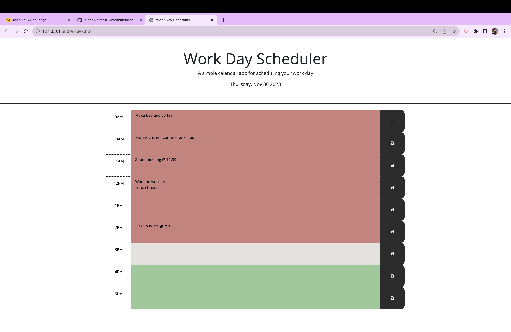

# Challenge 5 - Work Day Calender

## Description
My motivation for this project was to make a 9am-5pm work day plan calender using HTML, CSS, and JavaScript. At the top of the page, the current day and date will be shown. Underneath the date it will display 8 hours of slots, color coded to past, present, and future depending on what hour it is. When you click on a slot you can then add an event in that hour and click save to save the event to the local storage. When you refresh or revisit the link, your tasks will still be listed under the correct hour.

## Image and Link:

Link to deployed website:   https://aleahwhite.github.io/05-workcalender/ 

## Installation:
N/A

## Usage:
The use of this webpage is to be able to specifically plan out your work day by adding your tasks under the hour it needs to be done by and saving them. The color coding of the planner will help you know what you have completed or if you stil have things to do for the day.

## Credits:
N/A

## License:
Please refer to the MIT License in the repository!
